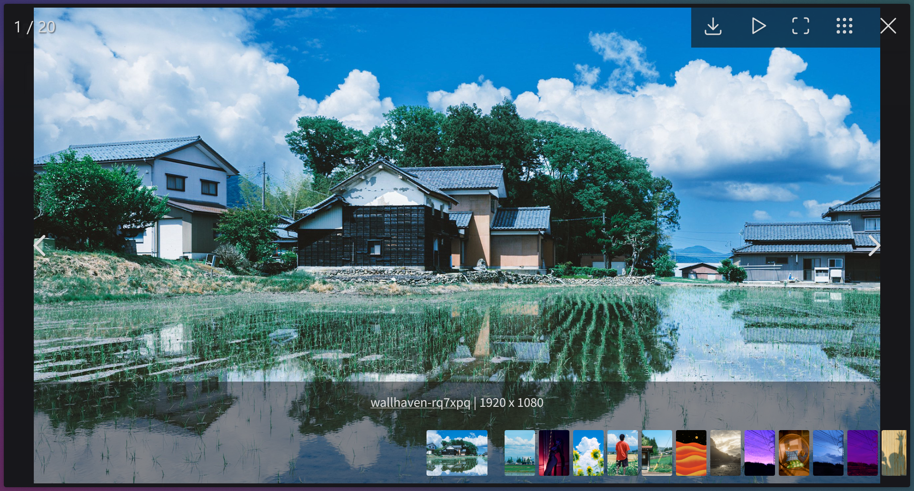

# Wallhaven Enhance+

Some More Wallhaven Enhancements, based on New Wallhaven Enhance.

## Description

This script adds a one-click download button to every image in Wallhaven's multi-image list mode (i.e. Hot playlist, Recents, any other filter...).
It also implements Fancybox, allowing a seamless fullscreen carousel browsing experience.

Original script can be found here: [New Wallhaven Enhance](https://greasyfork.org/en/scripts/420150-new-wallhaven-enhance) by Stéphane Beaudet, which is based on [Wallhaven Enhance](https://greasyfork.org/en/scripts/29444-wallhaven-enhance).

## Screenshots

## Usage

Install the `wallhavenenhancep.user.js` into TamperMonkey/GreaseMonkey.

## Changes

- I simply updated the Fancybox framework to 5.0 and rewrote the code so it works with the new version
- removed unnecessary lines and implementations, since Fancybox is a cool framework
- made downloads easier with `GM_download()` function instead of the anchor-workaround
